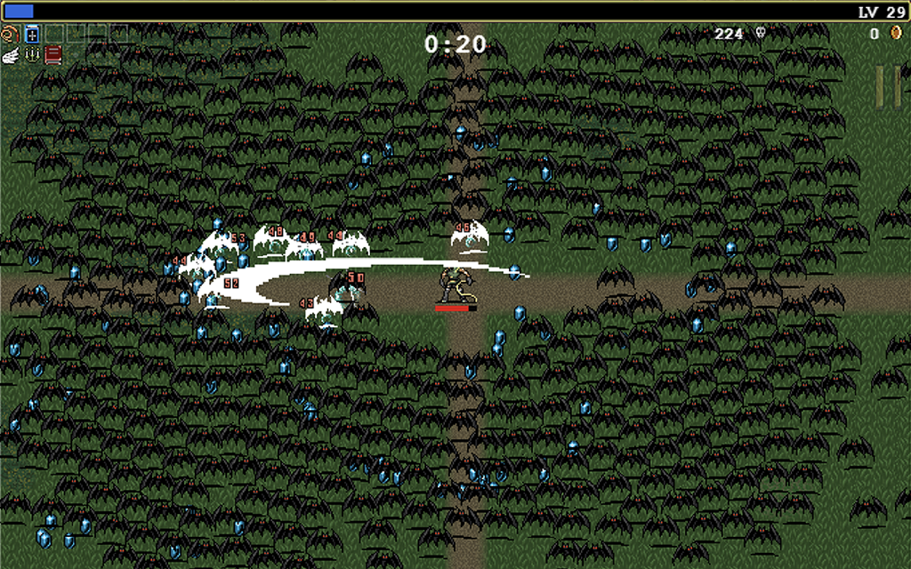
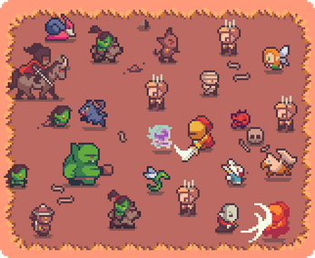

# Game software development

## Game description

Our game  will be based on `Vampire Survivors` game. This game is `rogue like` and a `shoot them up` game.

    

We will use the following assets:

    

## Story

Alors on prend des handicapés et on les met des une cage pour se battre.

## Specifications

### Menu

The menu will contains 4 buttons:

- Play

- Player stats

- settings

- Exit

#### Settings

It will be possible to:

- Change the volume (percentage)

- Mute the music

- Mute special effect sounds

- Change the bindings

#### Player stats

It will be possible to upgrade the following stats with  a coin based system:

- Health

- Attack

- Shield

- Offense zone

### HUD

During the game the following information will be displayed on the HUD:

- Health

- Level

- Time

- Coins

### Skill tree during the game

During the game, when leveling up, the player will be able to choose a new weapon, up to 6, or upgrade an existing weapon.

### End of the game

#### Win

To win, the player has to survive the amount of minute selected at the beginning of the game.

#### Loose

If the player has no longer health point he looses and the game is over.
